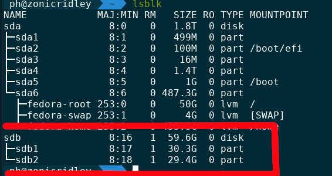
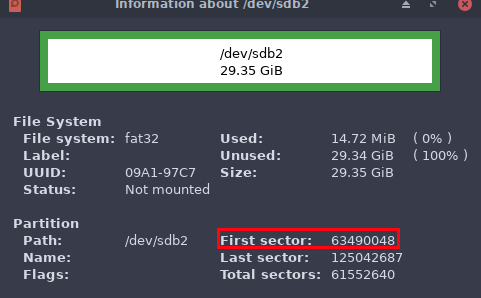

# Emummc (emunand) manual guide
This guide is written for Linux users

By PhazonicRidley

-----
!!!danger "Guide is not finished"
	This guide is unfinished and may contain errors. Continue at your own risk! This guide is more as something you can hold onto while doing this. Report any errors in the guide to Such Meme, Many Skill#2921 or PhazonicRidley#1432 on Discord.

## What you need:

- A micro SD card at least 64gb
- An unpatched switch
- A good amount of spare time
- A micro SD card adapter or a way to plug in a micro SD card to a computer
- Atmosphere 9.0 or later

## Instructions: 

### Part 1: The Backup

!!!warning "Before you start:"
    Make sure you've deleted all your wifi connections on your switch beforehand. It's not a good idea to connect to the internet in emunand. You can add the wifi networks back on sysnand after following this guide.

1. Boot into hekate and make a boot0/1 and raw gpp backup, you can see the full instructions on how to do this [here](https://nh-server.github.io/switch-guide/user_guide/making_essential_backups/)
2. Copy these backups to your PC.
3. Combine the boot0, boot1, and the rawnand backup into a single file, the command to do this is `cat boot0.bin boot1.bin rawnand.bin > emummc.bin`


!!!note "If you have you have you nand back up in multiple parts"
    You can run the above `cat` command but instead of `rawnand.bin` you would put each and ever nand backup part eg `rawnand.bin.00 rawnand.bin.01 rawnand.bin.02 <etc>`

### Part 2: The Formatting
1. Check to make sure gparted is installed (should be with most distros). Open it, and then go to the top right corner and click the correct stoarge device

2. Create 2 partitions, the last one needs to be 29.3GB in size, the first partition can be filled with the rest of the space available. Please make sure *both* partitions are FAT32

### Part 3: The Flashing

1. Open a terminal and type `lsblk`

2. Locate your SD card in the list of storage devices
    

3. Now we are going to use `dd` to flash your emunand to the second partition
!!!tip "To flash with `dd` do the following first:"
    Locate the path to your emunand backup (the file called `emummc.bin`) this will be your `if`, or *Input File* 
    !!!note "If the path to your emunand contains a space"
        you would add a \ to indicate a space, ex `if=/home/ubuntu/My\ Folder/emummc.bin` alternitivly you may put that folder name in quotes.
    
    Then locate the second, 32GB, partition of the sd card, this will your of. this will be shown as `of=/dev/sd*xY*/` replace *x* with the device letter, and *Y* with the partition number, eg `of=/dev/sdb2` or `of=dev/mmcblkp2`. `lsblk` will show you information about your storage devices.

3. Now we do the actual flashing, run the command `sudo dd if=/path/to/emummc.bin of=/dev/sd*xY*/ bs=512M status=progress`

!!!note "Note"
    This will take quite a while, if you forgot to add the `status=progress` flag the terminal will not show any output but rest assured, it is flashing

    

### Part 4: Get offset

1. Open gparted and go to your sd card.
2. Right click on the partition that you flashed your emunand to and select `Information`

!!!tip "You should see the following:"
    
    
Grab the first sector number and run it through a deciamal to hex converter, one can be found [here](https://www.rapidtables.com/convert/number/decimal-to-hex.html). You will need the hex value later


### Part 5: Setup ini

1. Create a folder on the root of the sd card that **YOU DID NOT** flash your emunand to called `emummc`
2. Create a file in the emummc folder called `emummc.ini`. Put the following into that ini:
```
[emummc]
emummc_enabled = 1
emummc_sector = 0x(hex offset)
```
The hex offset is the hex value you obtained in part 4. this is at most 8 hex characters Replace "(hex offset)" with your obtained hex offset

-----

Now if you boot fusee-primary.bin, you'll instead boot into emunand. You'll see the new black and white Atmosphere logo if you did it successfully.    

Your emunand's Nintendo folder can be found in your `emummc` folder. It will be called something like `Nintendo_0000`.

-----

#### Credits:

Thank you to SciresM, m4xw, hexkyz, and ctcaer for making emunand a reality!

Thank you to Such Meme, Many Skill for hosting the guide and providing the orginal structure of the guide.

Lastly thanks to everyone who helped with the creation of this guide.